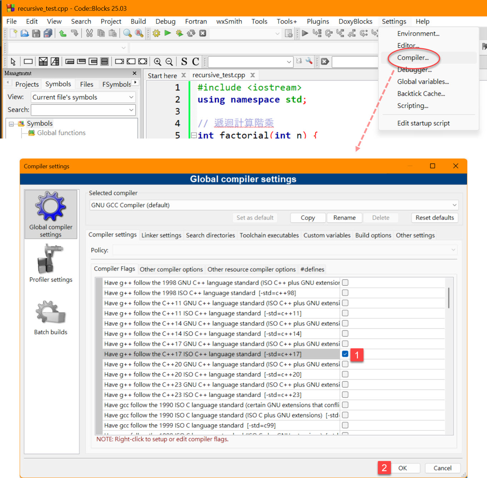
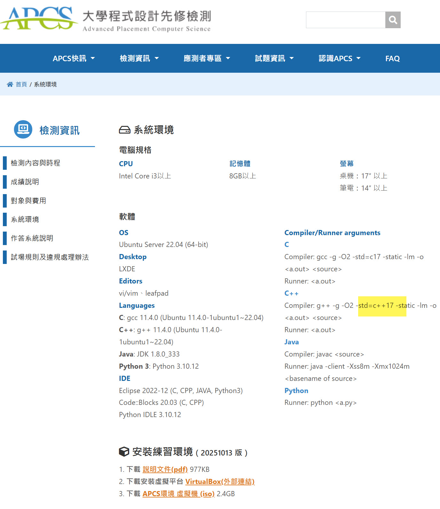
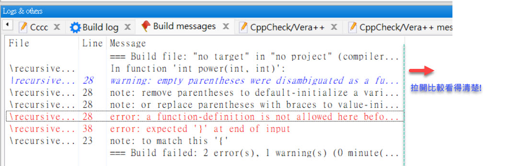
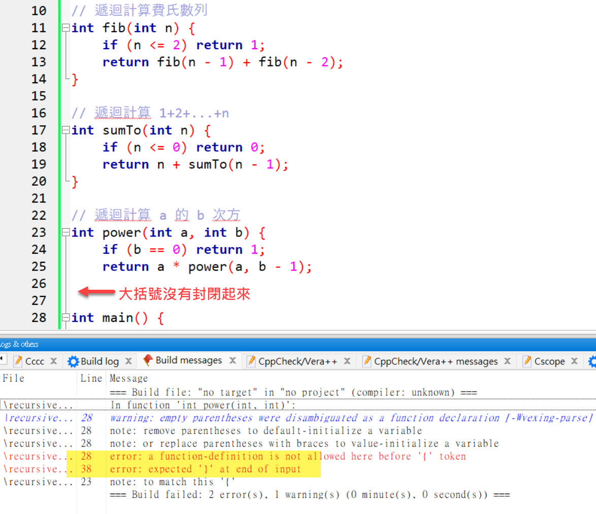
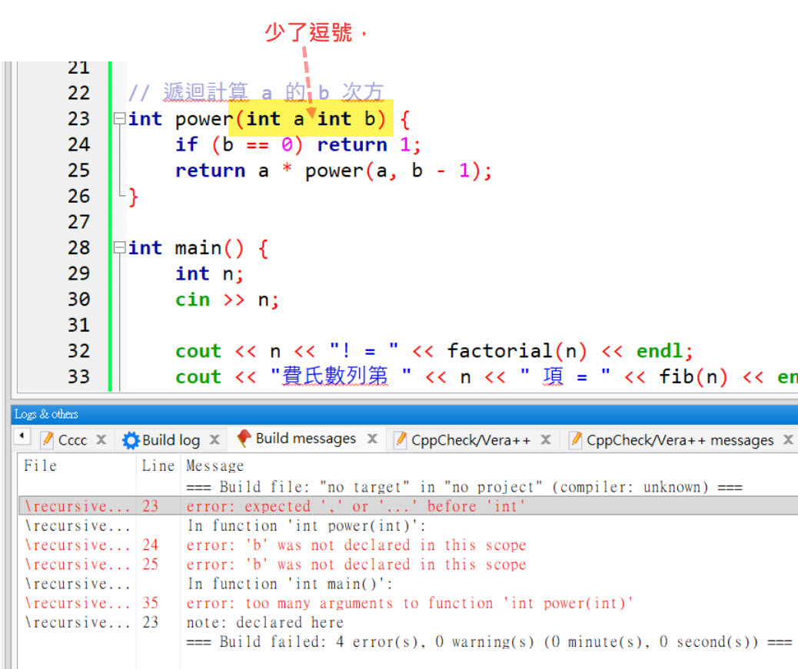

# 如何在 Code::Blocks 中查看編譯錯誤訊息

APCS 實作題使用 Code::Blocks 作為開發環境，當程式有錯誤時，學會看懂錯誤訊息非常重要！

---

## Step 1：開啟 C++17 標準（非常重要！）



**APCS 考試只支援 C++17**，必須開啟才能使用現代 C++ 語法（如 `vector`、`sort`、`auto` 等）。

### 設定步驟

1. 點選上方選單 **Settings** → **Compiler...**
2. 在 **Global compiler settings** 視窗中，找到 **Compiler Flags** 分頁
3. 勾選 `Have g++ follow the C++17 ISO C++ language standard [-std=c++17]`（標記 ①）
4. 點選 **OK** 儲存設定（標記 ②）

> ⚠️ **如果不勾會怎樣？**  
> 使用一些新語法或 STL 容器時，編譯器會狂噴你看不懂的 Error！

### 為什麼是 C++17？

| 問題 | 答案 |
|------|------|
| 可以用更高版本嗎？ | **不行**，APCS 考場只支援 C++17 |
| C++11 可以嗎？ | 可以，但建議直接用 C++17 |
| 不設定會怎樣？ | 預設可能是舊版 C++，很多語法會編譯失敗 |

---

## Step 2：APCS 官方系統環境



這是 APCS 官方網站公布的**系統環境**資訊，重點如下：

### 編譯器版本
- **C++**：g++ 11.4.0，使用 `-std=c++17` 標準
- **C**：gcc 11.4.0，使用 `-std=c17` 標準

### 編譯參數（C++）
```
g++ -g -O2 -std=c++17 -static -lm -o <a.out> <source>
```

| 參數 | 說明 |
|------|------|
| `-g` | 產生除錯資訊 |
| `-O2` | 最佳化等級 2 |
| `-std=c++17` | 使用 C++17 標準 |
| `-static` | 靜態連結 |
| `-lm` | 連結數學函式庫 |

> 💡 **重點**：確認你的 Code::Blocks 設定與官方一致，避免考試時出現意外！

---

## Step 3：查看錯誤訊息



當程式編譯失敗時，錯誤訊息會顯示在下方的 **Build messages** 分頁中：

| 欄位 | 說明 |
|------|------|
| **File** | 發生錯誤的檔案名稱 |
| **Line** | 錯誤發生在第幾行 |
| **Message** | 錯誤訊息內容 |

### 常見錯誤類型

- **紅色 error**：必須修正，否則無法編譯
- **黃色 warning**：警告，建議修正但不影響編譯

> 💡 **小技巧**：把視窗往右拉開，可以看到完整的錯誤訊息！

---

## Step 4：錯誤範例 - 大括號沒有配對



### 錯誤訊息

```
error: a function-definition is not allowed here before '{' token
error: expected '}' at end of input
```

### 問題分析

這兩個錯誤的意思是：**大括號沒有正確配對**

如圖所示，第 26 行的 `power` 函數**少了一個 `}`**，導致：
- 編譯器在第 28 行看到 `int main()` 時，以為還在上一個函數裡面
- 最後檔案結束時，發現還有 `{` 沒有配對

### 如何找到錯誤？

1. 看 **Line** 欄位，找到錯誤發生的行數（例如第 28 行）
2. 往上檢查該行附近的大括號 `{` `}` 是否有配對
3. 善用縮排來幫助你看出括號配對問題

### 常見的括號配對錯誤

| 錯誤訊息 | 可能原因 |
|----------|----------|
| `expected '}' at end of input` | 少了 `}` |
| `expected ';' before '}'` | 少了 `;` |
| `a function-definition is not allowed here` | 函數定義在錯誤的位置（通常是括號沒配對） |

---

## Step 5：錯誤範例 - 函數參數少了逗號



### 錯誤訊息

```
error: expected ',' or '...' before 'int'
error: 'b' was not declared in this scope
error: too many arguments to function 'int power(int)'
```

### 問題分析

如圖所示，第 23 行的 `power` 函數宣告：
```cpp
int power(int a int b)  // ❌ 少了逗號！
```

應該要寫成：
```cpp
int power(int a, int b)  // ✓ 正確
```

### 連鎖反應

因為少了逗號，編譯器會產生一連串的錯誤：
1. `expected ',' or '...'`：期望看到逗號
2. `'b' was not declared`：因為 `b` 沒有被正確宣告
3. `too many arguments`：呼叫時參數數量不對

> 💡 **重點**：修正第一個錯誤後，後面的錯誤通常會自動消失！

---

## 除錯小技巧

1. **從第一個錯誤開始修**：後面的錯誤可能是連鎖反應
2. **注意行號**：錯誤訊息會告訴你在哪一行
3. **檢查括號配對**：這是最常見的錯誤
4. **檢查分號**：每個語句結尾都要有 `;`
5. **善用縮排**：良好的縮排可以幫助你看出括號配對問題

---

## 快速鍵

| 快速鍵 | 功能 |
|--------|------|
| `F9` | 編譯並執行 |
| `Ctrl+F9` | 只編譯不執行 |
| `Ctrl+Shift+F9` | 重新編譯全部 |
